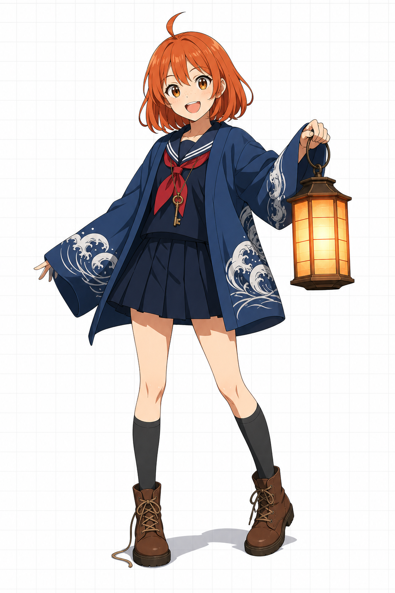
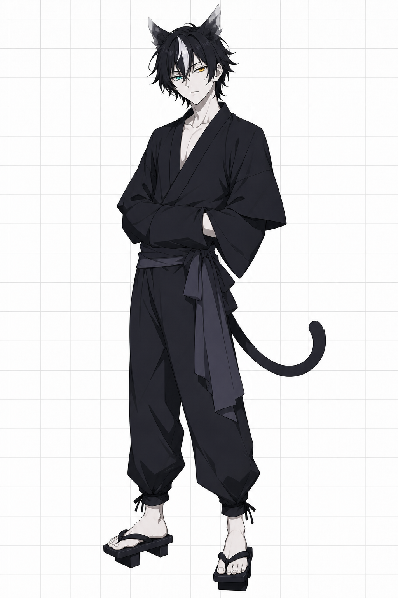
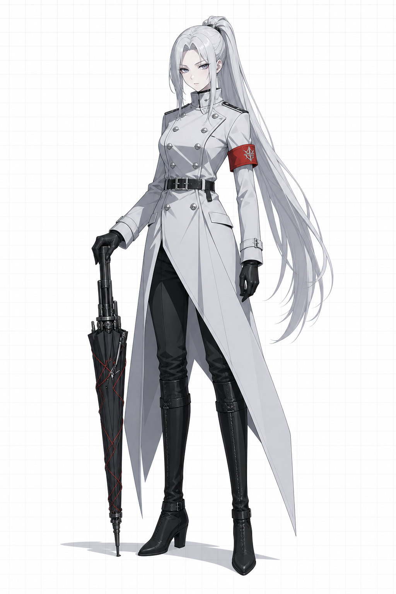
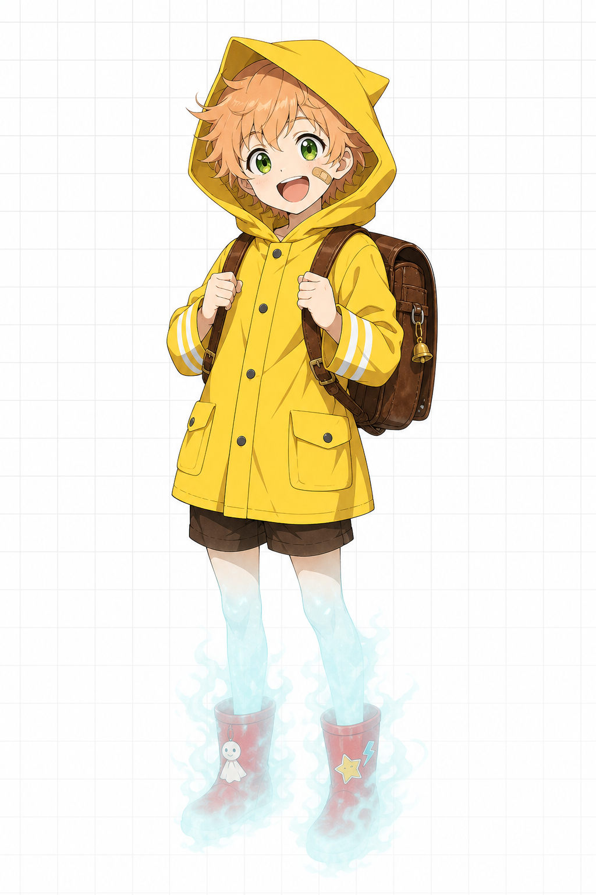

# 角色设定集

> キャラクターデザイン資料集 / Character Design Bibles

原创动画与游戏角色的设定集合。目前收录两个**互不相关**的企划，
各自拥有独立的世界观、画风基线与作画规范，请勿混用。

| 企划 | 媒体 | 画风 | 角色数 | 入口 |
| --- | --- | --- | --- | --- |
| 《雾见町 遗物招领所》 | 深夜档 TV 动画（12 话） | 硬边赛璐璐，锐利线稿，扁平色块 | 4 | [docs/kirimicho](docs/kirimicho/00-世界观设定.md) |
| 《黄昏之羽》 | 日式幻想 RPG 手游 | 柔和赛璐璐 + 水彩渐变，低对比度 | 1 | [docs/icarus](docs/icarus/00-企划与世界观.md) |

---

## 企划一 ·《雾见町 遗物招领所》

被人遗忘的物品会在夜雾中长出形体。少女继承了祖母的"遗物招领所"，
把它们送回主人手中——或者，替它们好好地送终。


| 文档 | 内容 |
| --- | --- |
| [00 世界观设定](docs/kirimicho/00-世界观设定.md) | 舞台雾见町、遗物灵的三条法则、阵营对立、设计统一约束 |
| [01 天野 灯莉](docs/kirimicho/01-角色-天野灯莉.md) | 主角。16 岁，第三代招领人，能听见物品的记忆 |
| [02 墨](docs/kirimicho/02-角色-墨.md) | 搭档。招领所的守护猫灵，活了 240 年以上 |
| [03 时雨 冴](docs/kirimicho/03-角色-时雨冴.md) | 对手役。回收局执行官，主张即刻销毁遗物灵 |
| [04 帆坂 忍](docs/kirimicho/04-角色-帆坂忍.md) | 配角。滞留 10 年的孩童灵，全剧最大的伏笔 |
| [05 作画规范](docs/kirimicho/05-作画规范.md) | 头身比、脸部基准、线稿粗细、赛璐璐 7 层上色、提交检查表 |
| [06 关系图与剧情钩子](docs/kirimicho/06-关系图与剧情钩子.md) | 关系图、三组情感对照、伏笔清单、12 话构成 |
| [07 立绘生成提示词](docs/kirimicho/07-立绘生成提示词.md) | 四名角色 + 主视觉的出图提示词 |

| 角色 | 年龄 | 身高 / 头身 | 主色 | 剪影识别点 |
| --- | --- | --- | --- | --- |
| 天野 灯莉 | 16 | 156 cm / 6.8 | `#E8703A` | 半纏 + 呆毛 + 纸灯笼 |
| 墨 | 外观 17 | 178 cm / 7.5 | `#23222A` | 猫耳 + 尾巴 + 袖手姿势 |
| 时雨 冴 | 19 | 171 cm / 7.8 | `#E4E7EE` | 高马尾 + 大衣下摆 + 伞枪 |
| 帆坂 忍 | 12 | 142 cm / 5.5 | `#F5C93F` | 雨衣尖帽 + 旧书包 |

| | |
| --- | --- |
|  |  |
|  |  |

按 [07 立绘生成提示词](docs/kirimicho/07-立绘生成提示词.md) 生成的概念立绘（3:4，设定稿风格），非最终作画稿：

| 天野 灯莉 | 墨 | 时雨 冴 | 帆坂 忍 |
| --- | --- | --- | --- |
|  |  |  |  |

---

## 企划二 ·《黄昏之羽》

悬停在恒定黄昏中的浮空都市。背生羽翼的"羽者"每使用一次力量，
就会永久失去一部分羽毛——飘散在她身边的粉色羽毛，是正在流失的寿命。

| 文档 | 内容 |
| --- | --- |
| [00 企划与世界观](docs/icarus/00-企划与世界观.md) | 天层都市艾莉西恩、羽者的三条法则、企划定位 |
| [01 伊卡洛斯](docs/icarus/01-角色-伊卡洛斯.md) | 主角。第七位羽者「黄昏之羽」，完整设定表 |
| [02 提示词集](docs/icarus/02-提示词集.md) | 模块化的中英双语出图提示词、参数建议、失败修补词 |
| [03 企划共通规范](docs/icarus/03-企划共通规范.md) | 画风基线、光照规则、材质表现、后续角色的视觉公约 |


| 概念立绘（雾见町 TV 赛璐璐画风） |
| --- |
|  |

参考图与生成的立绘请存入 `assets/icarus/refs/` 与 `assets/icarus/concepts/`。

---

## 目录结构

```
docs/
  kirimicho/           《雾见町 遗物招领所》设定文档
  icarus/              《黄昏之羽》设定文档
assets/
  kirimicho/
    proportions.svg    头身比对照图
    palettes/*.svg     各角色配色卡
    concepts/*.png     示例立绘（概念稿）
  icarus/
    palettes/*.svg     各角色配色卡
    refs/              用户提供的原始参考图
    concepts/          生成的立绘与设定稿
tools/
  palettes.json        配色与比例数据源（唯一真实来源）
  gen_visuals.py       由 JSON 生成上述 SVG
```

## 修改配色

色号与头身比只在 `tools/palettes.json` 中维护，改完后重新生成 SVG：

```bash
python3 tools/gen_visuals.py
```

脚本只依赖 Python 3 标准库，无需安装第三方包。
新增企划时，在 `tools/palettes.json` 的 `works` 下加一个条目即可，
输出路径会自动变为 `assets/<企划 id>/`。修改身高或头身比时，
请同步更新对应角色的设定文档。
