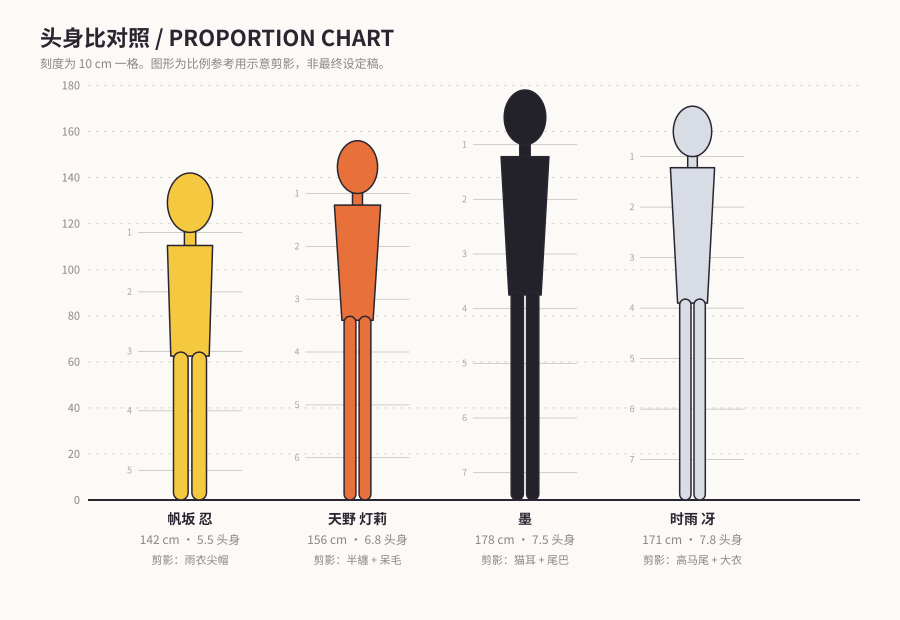
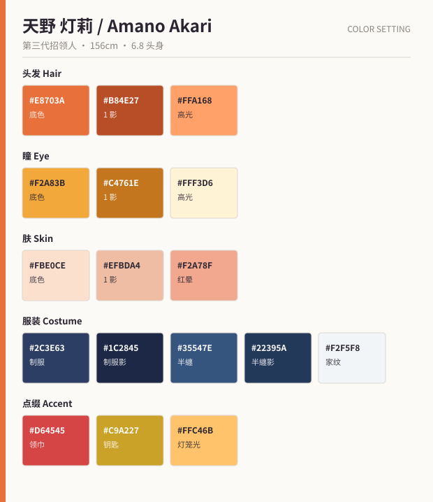

# 《雾见町 遗物招领所》角色设定集

> キャラクターデザイン資料集 / Character Design Bible
> 想定媒体：深夜档 TV 动画（1 クール・全 12 话）

一套完整的原创动画角色设定：世界观、四名主要角色的设定表（含全部 HEX 色号、服装差分、
表情差分、作画注意事项）、共通作画规范，以及角色关系图与伏笔清单。



---

## 目录

| 文档 | 内容 |
| --- | --- |
| [00 世界观设定](docs/00-世界观设定.md) | 企划一句话、舞台雾见町、遗物灵的三条法则、阵营对立、设计统一约束 |
| [01 天野 灯莉](docs/01-角色-天野灯莉.md) | 主角。16 岁，第三代招领人。能听见物品的记忆 |
| [02 墨](docs/02-角色-墨.md) | 搭档。招领所的守护猫灵，活了 240 年以上 |
| [03 时雨 冴](docs/03-角色-时雨冴.md) | 对手役。回收局执行官，主张即刻销毁遗物灵 |
| [04 帆坂 忍](docs/04-角色-帆坂忍.md) | 配角。滞留 10 年的孩童灵，全剧最大的伏笔 |
| [05 作画规范](docs/05-作画规范.md) | 头身比、脸部基准、线稿粗细、赛璐璐 7 层上色、材质表现、提交检查表 |
| [06 关系图与剧情钩子](docs/06-关系图与剧情钩子.md) | 关系图、三组情感对照、设计伏笔清单、12 话构成 |
| [07 立绘生成提示词](docs/07-立绘生成提示词.md) | 四名角色 + 主视觉的出图提示词，可直接在本地 Cursor Agent 中使用 |

## 角色一览

| 角色 | 年龄 | 身高 / 头身 | 主色 | 剪影识别点 |
| --- | --- | --- | --- | --- |
| 天野 灯莉 | 16 | 156 cm / 6.8 | `#E8703A` | 半纏 + 呆毛 + 纸灯笼 |
| 墨 | 外观 17 | 178 cm / 7.5 | `#23222A` | 猫耳 + 尾巴 + 袖手姿势 |
| 时雨 冴 | 19 | 171 cm / 7.8 | `#E4E7EE` | 高马尾 + 大衣下摆 + 伞枪 |
| 帆坂 忍 | 12 | 142 cm / 5.5 | `#F5C93F` | 雨衣尖帽 + 旧书包 |

## 配色卡

| | |
| --- | --- |
|  |  |
|  |  |

---

## 目录结构

```
docs/                  设定文档（Markdown）
assets/
  proportions.svg      头身比对照图
  palettes/*.svg       各角色配色卡
tools/
  palettes.json        配色数据源（唯一真实来源）
  gen_visuals.py       由 JSON 生成上述 SVG
```

## 修改配色

色号只在 `tools/palettes.json` 中维护，改完后重新生成 SVG：

```bash
python3 tools/gen_visuals.py
```

脚本只依赖 Python 3 标准库，无需安装第三方包。
修改身高或头身比时，同时更新 `tools/gen_visuals.py` 里的 `FIGURES` 表与对应角色设定文档。
