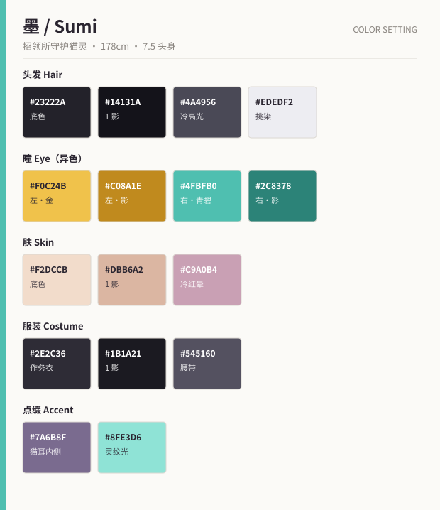

# 墨（すみ / Sumi）

> 「随便你。反正你哭的时候，我还是会在。」

---

## 1. 基础信息

| 项目 | 内容 |
| --- | --- |
| 定位 | 搭档 / 观察者。四番町遗物招领所的守护猫灵 |
| 外观年龄 | 17 岁 / 男性形态（本体无性别） |
| 实际年龄 | 不明。至少 240 年（自招领所建立起） |
| 身高 | 178 cm（人形态） / 体长 42 cm（猫形态·黑猫） |
| 生日 | 无。庆生时自称"就当是今天吧" |
| 惯用手 | 左手 |
| CV 印象 | 低而慵懒，尾音上挑，笑的时候不带气声 |

---

## 2. 性格

- 慵懒、毒舌、事不关己的旁观者姿态，实则是全作**唯一见过全部三代招领人**的存在。
- 对灯莉的态度：嘴上嫌麻烦，行动上从不缺席。这个落差是他全部的角色魅力来源。
- 因为送走过太多人，他早已学会"不投入"。主线的另一半是他重新愿意去在乎。
- **口癖**：「めんどくさ」（麻烦死了）／ 认真时会改口叫灯莉的全名「天野灯莉」。
- **禁忌**：不能踏出招领所地界 500 米以外，超出即失去人形。

## 3. 能力

**「境（さかい）」**——在遗物灵与人之间划出一道可视的界线，
界线内时间流速减半，用于争取交涉时间。开界时脚下浮现墨色水纹（青碧色 `#8FE3D6` 描边）。
代价是每次开界都会消耗他维持人形的力量，用多了会强制变回猫。

---

## 4. 外貌设计

### 4.1 头部

| 部位 | 设计 |
| --- | --- |
| 发型 | 墨黑色微乱中长发，发尾略翘。**额前一缕挑染的白色发丝**（是被祖母摸过的地方，本人从不解释） |
| 瞳 | 异色瞳：**左金 `#F0C24B` / 右青碧 `#4FBFB0`**。瞳孔为竖长猫瞳，在暗处放大成圆形——这是他情绪失控的唯一提示 |
| 眼型 | 细长上挑的三白眼，眼睑常半垂 |
| 猫耳 | 平时不显形。**情绪波动 / 使用能力 / 被戳穿心事**时半透明浮现（内耳 `#7A6B8F`），是他的"谎言探测器" |
| 尾巴 | 与猫耳同条件显形。尾尖动作独立于表情，作画时当作独立演员处理 |
| 肤 | 偏冷的苍白，无血色。红晕只在极少数场合出现，且用紫调而非橙调 |

### 4.2 服装

- 改造过的**现代款黑色作务衣**：上衣为短款、宽袖，敞开的领口露出锁骨；
  下身宽松长裤，裤脚以细带束起。
- 深灰腰带一圈半，尾端垂在左侧。
- 赤脚穿黑木屐（走路无声——他不接触地面时才是真正在"走"）。
- 习惯**双手插在对侧袖子里**（袖手），这是他的默认待机姿势，
  只有真正要出手时才把手抽出来。这个动作的"抽手"瞬间是他的高光演出。

### 4.3 配色

| 用途 | 底色 | 1 影 | 2 影 / 高光 |
| --- | --- | --- | --- |
| 头发 | `#23222A` | `#14131A` | 高光 `#4A4956`（冷调，禁用暖色高光） |
| 挑染 | `#EDEDF2` | `#C2C2CE` | — |
| 瞳（左） | `#F0C24B` | `#C08A1E` | 高光 `#FFF6DC` |
| 瞳（右） | `#4FBFB0` | `#2C8378` | 高光 `#DFFFF8` |
| 肤 | `#F2DCCB` | `#DBB6A2` | 冷红晕 `#C9A0B4` |
| 作务衣 | `#2E2C36` | `#1B1A21` | — |
| 点缀 | 腰带 `#545160` ／ 灵纹光 `#8FE3D6` ／ 猫耳内侧 `#7A6B8F` |

---

## 5. 形态差分

| 编号 | 形态 | 用途 |
| --- | --- | --- |
| A | 人形态（通常） | 主力 |
| B | 人形态 + 猫耳尾显形 | 情绪 / 战斗 |
| C | 黑猫形态（左右眼同样异色，颈上有旧红绳） | 日常搞笑回、以及他"不想说话"的时候 |
| D | 中间形态（轮廓崩解为墨迹） | 力量耗尽，仅第 8 话与第 11 话 |
| E | 240 年前的和装（结发、藏青长着） | 回忆篇 |

---

## 6. 表情差分

| # | 表情 | 要点 |
| --- | --- | --- |
| 1 | 通常（无表情） | 眼半垂，嘴一条直线。**默认状态，占比最高** |
| 2 | 冷笑 | 单边嘴角上扬 5°，眼不笑，猫耳不出 |
| 3 | 无语 | 眼白多、瞳缩小、嘴角下撇成"へ" |
| 4 | 认真 | 猫瞳收缩成细线，前发被风压向后，无口 |
| 5 | 慌乱（罕见） | 猫耳与尾巴猛然全显形 + 瞳孔放大成圆，脸不红。**每季限用 3 次** |
| 6 | 真心的笑 | 闭眼、眉尾下垂、嘴角自然上扬。全剧**仅第 12 话使用一次** |
| 7 | 杀气 | 瞳孔竖线 + 眼下加一道硬阴影，画面整体降饱和 |
| 8 | 打哈欠 | 猫科式大张口 + 眯眼 + 尾巴抖一下 |

---

## 7. 作画注意事项

1. **他不该有"人味"的细节**：不画汗、不画呼吸的肩部起伏、不画脸红（红晕改用紫调）。
   唯一例外见第 12 话。
2. **猫耳与尾巴是台词的一部分**。当他嘴上说"无所谓"而耳朵立起来时，
   观众就明白了——这是本作最主要的喜剧与情感手法，不要为了省工数而删。
3. **袖手姿势**下，手臂轮廓是一条完整的水平弧线，不要画出手部形状。
4. **走路不出声**：脚步动画不加尘土、不加接地音效对应的画面震动。
5. 与灯莉同框时，他**永远站在灯笼光照不到的那一侧**（画面构图硬性规定），
   直到最终话他第一次走进光里。
