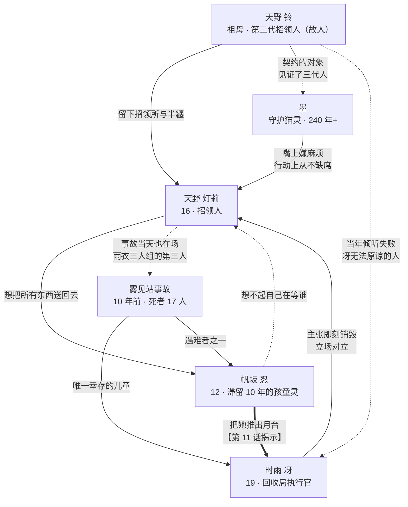

# 角色关系图与剧情钩子

## 1. 关系图

## 2. 情感轴的三组对照

| 对照 | A 侧 | B 侧 | 主题 |
| --- | --- | --- | --- |
| **手段** | 灯莉：用手去碰（倾听） | 冴：用工具隔开（销毁） | 共情 vs 责任 |
| **时间** | 忍：停在 10 年前 | 墨：活了 240 年 | 停滞 vs 漫长 |
| **告别** | 灯莉：拒绝失去 | 墨：习惯失去 | 主角的成长方向 |

## 3. 各角色的"设计伏笔"清单

设计阶段就埋好、需要在作画中长期维持的细节：

| 角色 | 视觉伏笔 | 回收话数 |
| --- | --- | --- |
| 灯莉 | 半纏袖子过长（"还没长到她身上"） | 第 12 话改为合身 |
| 灯莉 | 幼年穿黄色雨衣 | 第 11 话 |
| 墨 | 额前那缕白色挑染 | 第 8 话（祖母摸过的地方） |
| 墨 | 永远站在灯笼光的暗侧 | 第 12 话走进光里 |
| 墨 | 无汗、无脸红、无呼吸起伏 | 第 12 话首次出现脸红 |
| 冴 | 从不摘手套 | 第 10 话摘下 |
| 冴 | 全身唯一的红（臂章） | 第 10 话卸下，进入无彩色 |
| 冴 | 独处时从 17 数到 1 | 第 6 话点明是死者人数 |
| 忍 | 铃铛摇动但不响 | 第 11 话响一次 |
| 忍 | 创可贴十年不换 | 第 11 话 |
| 忍 | 没有脚、没有影子、没有倒影 | 全篇维持 |
| 三人 | 黄色雨衣三重奏 | 第 11 话书包里的画 |

## 4. 12 话构成（角色出场配比）

| 话数 | 主视点 | 内容 |
| --- | --- | --- |
| 1 | 灯莉 | 祖母的葬礼与继承。初遇墨 |
| 2 | 灯莉 | 第一件委托：一把没被带走的伞 |
| 3 | 忍 | 忍登场。旧月台的日常 |
| 4 | 冴 | 冴登场。首次立场冲突 |
| 5 | 灯莉 | 第一次"送终"而非"送还" |
| 6 | 冴 | 数到 17 的理由。事故的全貌（表层） |
| 7 | 冴 | 便装回。两人第一次不以立场对话 |
| 8 | 墨 | 240 年前的回忆。白色挑染的由来 |
| 9 | 全员 | 祟物袭击。色温规则被打破 |
| 10 | 冴 | 摘手套、卸臂章。平视镜头 |
| 11 | 忍 | 书包打开。三件黄色雨衣 |
| 12 | 灯莉 | 送别与继承。袖子合身了 |

## 5. 键盘台词（角色语气校准用）

作画与配音时用来校准"这个角色会不会这么说"：

- **灯莉**：「送り返すのが仕事。……送ってあげるのも、仕事」
- **墨**：「二百四十年ぶりに、めんどくさいって思えたよ」
- **冴**：「私は数える側になった。もう、数えられる側じゃない」
- **忍**：「あのね、思い出したよ。ずっと、待っててくれてありがとう」
