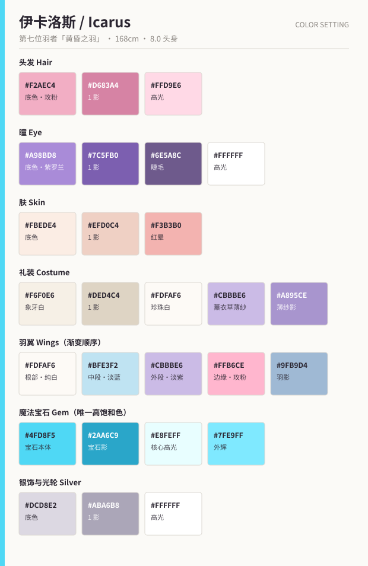
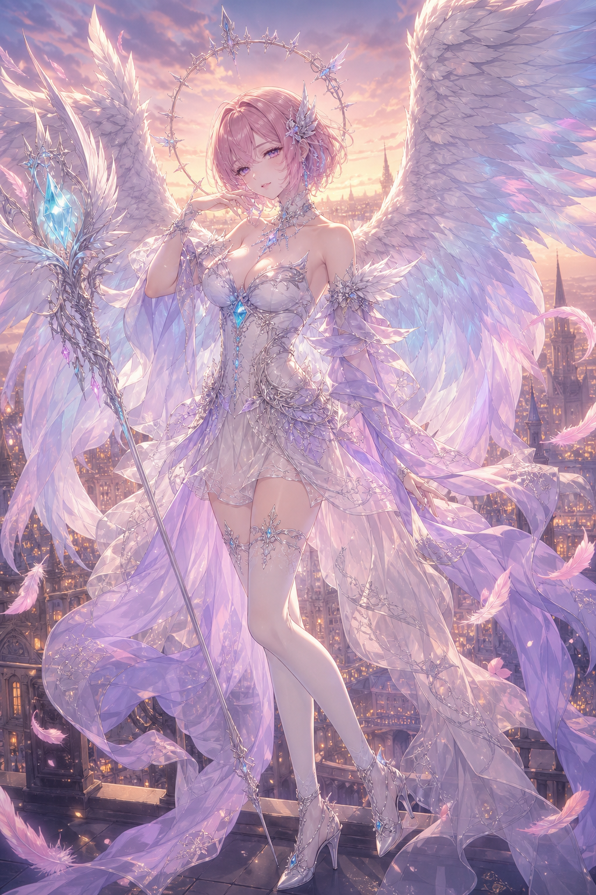

# 伊卡洛斯（イカロス / Icarus）

> 「翅膀轻一点了呢。……没关系，还能再飞一会儿。」

---

## 1. 基础信息

| 项目 | 内容 |
| --- | --- |
| 定位 | 主角 / 主视觉担当。天层都市艾莉西恩 · 第七位羽者 |
| 年龄 / 性别 | 成年女性（外观 22～24 岁） |
| 身高 / 头身 | 168 cm（含高跟约 180 cm）／ **8.0 头身** |
| 称号 | 「黄昏之羽」（Feather of Dusk） |
| 职阶 | 圣女 / 法杖使（后卫 · 治疗与光属性） |
| 气质关键词 | 优雅、神秘、圣洁，带一丝慵懒与魅惑 |
| CV 印象 | 柔和的中低音，语速偏慢，句尾轻微下沉 |

---

## 2. 性格

- 表层温柔从容，对谁都以微笑与敬语相待，几乎不动怒。
- 那份**慵懒**不是天性，是长期用力量换寿命后的疲惫；
  那份**魅惑**也不是刻意，而是她已经不再在意世俗评价的松弛感。
- 深知自己终将坠落，因此对"来日方长"这类说法有种温柔的抗拒。
- **口癖**：「そう急がなくても」（不用那么急的）
- **反差**：私下极爱甜食与睡懒觉，能在任何地方睡着。这是她仅存的"活人"部分。

## 3. 能力

**「羽落（うらく）」**——散出羽毛，将其化为光，用于治愈、结界与净化。
- 效果越强，飞散的粉色羽毛越多，而羽毛不会再生。
- 演出规则：**画面中浮游羽毛的数量 = 她这一刻付出的代价**。
  日常场景 3～5 片，战斗高潮可达数十片。这是全企划最重要的视觉语法，不可随意增减。
- 法杖「エオス（Eos，黎明）」是羽落的聚焦媒介，本身没有攻击性。

---

## 4. 外貌设计

### 4.1 头部

| 部位 | 设计 |
| --- | --- |
| 发型 | **短款分层玫粉色波波头**。柔软的侧分刘海，发尾轻微内卷并带分层感，长度在下颌至颈侧之间 |
| 发色 | 玫粉 `#F2AEC4`，发根略深，发梢受环境光影响偏暖 |
| 瞳 | **紫罗兰色半眯眼**。眼型为柔和的下垂杏眼，上眼睑常压低约 1/3，形成慵懒感。睫毛纤长、下睫毛分明 |
| 眉 | 细而柔和，眉尾略下垂——这是"温柔"的来源，禁止画成上挑眉 |
| 表情基线 | 成熟温柔的微笑，嘴角小幅上扬，唇色偏淡珊瑚粉 |
| 肤 | 通透的暖白，低对比度阴影，禁止画毛孔与写实质感 |

### 4.2 光轮与发饰

- **光轮**：头后一圈纤细的银色环，环上有**小型尖刺**、羽毛与花形装饰，
  整体是**神圣徽记**而非科技设备——不要发光电路、不要几何 HUD、不要机械环。
  尖刺朝外，但设定上违抗天层时会向内收紧（见世界观第 3 条）。
- **发饰**：双耳侧佩戴**羽翼形银色发饰**，镶嵌小型紫色或蓝色水晶，
  左右可不对称，右侧略大。

### 4.3 服装（幻想天使礼装）

配色为**象牙白 + 珍珠白 + 淡薰衣草紫**三色构成。

| 部位 | 设计 |
| --- | --- |
| 上身 | 贴身的宝石胸衣结构，领口较低，露出肩部、锁骨与部分上胸。**保持完整穿着，非露骨表达** |
| 核心宝石 | 胸口中央一枚**青蓝色发光魔法宝石** `#4FD8F5`，外部由精致银色花纹与水晶结构包裹，并向腰部延伸出细密装饰线条 |
| 袖 | 半透明淡紫色薄纱袖套 + 长袖飘带，与手臂之间留有空隙，随风飘动 |
| 肩 | 轻盈的羽饰肩章，银色蕾丝收边 |
| 腰 | 流动的腰部垂饰，银色花朵状金属饰品 + 水晶节点 |
| 裙 | 短款多层薄纱结构，外层为半透明象牙白与淡紫 chiffon 飘带，侧面露出部分大腿线条 |
| 腿 | 白色或淡紫色**过膝长袜**，袜口有蕾丝与银色扣饰 |
| 足 | 精致的银色高跟幻想鞋，鞋面镶嵌小型青蓝色水晶，鞋跟细长，有薄底台 |

### 4.4 羽翼

- 背后一对**巨大、柔软、层次丰富的白色天使羽翼**，由大量细致羽毛构成。
- **渐变方向**：靠近身体为纯白 `#FDFAF6` → 淡蓝 `#BFE3F2` → 淡紫 `#CBBBE6` →
  边缘少量玫粉 `#FFB6CE`，边缘带柔和的冷色光泽。
- 结构必须是**自然的鸟类羽毛与优雅弧线**：
  ✗ 机械翅膀 ✗ 工业装甲 ✗ 硬表面推进器 ✗ 几何能量翼。
- **展开规则**：立绘中左右**不对称**展开，一侧高扬一侧低垂，用来撑起剪影。
- 部分粉色发光羽毛从翅膀边缘脱离，悬浮在角色周围（数量规则见第 3 节）。

### 4.5 法杖「エオス」

- 细长、优雅、轻盈。银白色金属 + 淡紫色装饰。
- 顶端为**羽翼与花瓣交叠**的结构，中央镶嵌一枚明亮的青蓝色水晶。
- 杖身有缠绕的丝带，末端渐细。
- ✗ 不要重型武器、✗ 不要科技枪械、✗ 不要巨大配重。

---

## 5. 配色规范

| 用途 | 底色 | 1 影 | 高光 / 备注 |
| --- | --- | --- | --- |
| 头发 | `#F2AEC4` | `#D683A4` | 高光 `#FFD9E6` |
| 瞳 | `#A98BD8` | `#7C5FB0` | 高光 `#FFFFFF`，睫毛 `#6E5A8C` |
| 肤 | `#FBEDE4` | `#EFD0C4` | 红晕 `#F3B3B0` |
| 象牙白礼装 | `#F6F0E6` | `#DED4C4` | 珍珠白 `#FDFAF6` |
| 薰衣草薄纱 | `#CBBBE6` | `#A895CE` | 半透明，不透明度 45～60% |
| 羽翼渐变 | `#FDFAF6` → `#BFE3F2` → `#CBBBE6` | `#9FB9D4` | 边缘玫粉 `#FFB6CE` |
| 魔法宝石 | `#4FD8F5` | `#2AA6C9` | 核心 `#E8FEFF`，外辉 `#7FE9FF` |
| 银饰 / 光轮 | `#DCD8E2` | `#ABA6B8` | 高光 `#FFFFFF` |
| 浮游羽毛 | `#FFB6CE` | — | 自发光，外辉 `#FFD9E6` |

**配色纪律**

1. 全身**只有一种高饱和色**：青蓝 `#4FD8F5`（宝石、杖尖水晶、鞋面水晶、羽翼边缘微光）。
   它同时承担视线引导，出现位置不得超过 5 处。
2. 粉色只允许出现在**头发**与**浮游羽毛**上，服装本体不得使用粉色。
3. 禁用纯黑与高饱和暖色（红、橙、黄），阴影一律用低对比度的紫灰调。

---

## 6. 差分

| 编号 | 名称 | 用途 |
| --- | --- | --- |
| A | 通常（天使礼装 + 全羽翼 + 法杖） | 主力立绘、角色卡 |
| B | 无光轮 / 无法杖 | 日常剧情立绘、Live2D 简化版 |
| C | 羽翼收拢（半展） | UI 半身像、对话框头像 |
| D | 觉醒（羽翼全展、浮游羽毛数十片、宝石强发光） | 必杀技演出、SSR 卡面 |
| E | 残翼（羽毛稀疏、边缘破碎、光轮尖刺内收） | 剧情后期，**羽毛数量必须明显少于 A** |
| F | 私服（宽松针织 + 长裙，羽翼收起，光轮消失） | 活动限定、日常回 |

---

## 7. 表情差分

| # | 表情 | 要点 |
| --- | --- | --- |
| 1 | 温柔微笑（基础） | 半眯眼 + 嘴角小幅上扬。**默认状态，占比最高** |
| 2 | 闭眼微笑 | 眼睛画成柔和下弯弧线，眉尾下垂 |
| 3 | 慵懒 | 眼睑压到 1/2，视线略下移，唇微启 |
| 4 | 惊讶 | 双眼睁到全开——**这是她唯一"睁眼"的表情**，冲击力全部来自于此 |
| 5 | 困扰 | 眉八字 + 嘴角一侧下压 + 手靠近脸颊 |
| 6 | 认真（咏唱中） | 闭眼、眉平、唇微动，宝石与杖尖强发光 |
| 7 | 忧郁 | 视线偏离画面外，瞳孔高光缩小，嘴唇平直。**不流泪** |
| 8 | 释然的笑 | 睁眼直视，瞳孔高光最大，嘴角上扬幅度全篇最大。终盘限定 |

---

## 8. 作画注意事项

1. **半眯眼是身份证**。除 4 号与 8 号表情外，上眼睑必须压低，
   一旦画成普通睁眼，角色识别度立刻消失。
2. **浮游羽毛不是特效，是台词**。数量对应她的付出，参见第 3 节的演出规则。
3. **羽翼是生物而非装备**：要有蓬松的绒羽层、自然的羽轴走向和柔和弧线。
   任何机械、装甲、几何化的处理都属于设计事故。
4. **薄纱的画法**：叠加处不加深轮廓线，仅提高不透明度；透出的皮肤或衣料要保留形状，
   不要糊成一片。薄纱与皮肤之间必须留出空隙，不要贴合。
5. **低对比度阴影**：全身阴影明度差不超过 20%，边缘半硬（介于赛璐璐与水彩之间）。
   这是本企划画风与《雾见町》硬边赛璐璐最大的区别。
6. **逆光原则**：主光来自角色背后的黄昏，形成柔和金色轮廓光；
   宝石、杖尖水晶与羽翼边缘发出青蓝与淡紫冷光。冷暖两套光必须同时存在。
7. **尺度守则**：领口低但完整穿着，侧面露腿但不露内衣，
   薄纱透出的部分必须有明确的服装结构。任何露骨表达都不符合本企划定位。
8. **剪影测试**：填黑后应能读出"不对称大羽翼 + 环形光轮 + 细长法杖 + 波波短发"四个特征。
