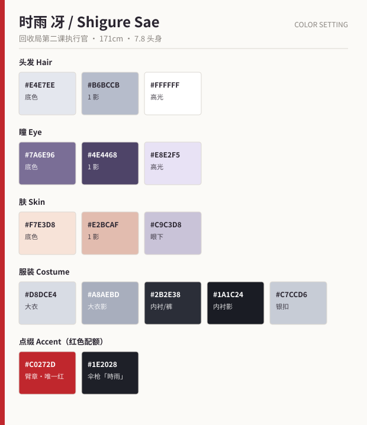

# 时雨 冴（しぐれ さえ / Shigure Sae）

> 「同情是免费的。责任不是。」

---

## 1. 基础信息

| 项目 | 内容 |
| --- | --- |
| 定位 | 对手役（非反派）。文化厅 特殊物件回收局 · 第二课执行官 |
| 年龄 / 性别 | 19 岁 / 女 |
| 身高 / 体重 | 171 cm / 54 kg |
| 生日 | 2 月 14 日（水瓶座） |
| 血型 | AB 型 |
| 惯用手 | 右手（伞枪为双手持） |
| CV 印象 | 清冷的中低音，语速平稳，几乎不带起伏 |

---

## 2. 性格

- 彻底的效率主义者，公文式说话。不讲废话，也不撒谎。
- 十年前「雾见站祟物灾害」死者 17 人，她是当时在场的**唯一幸存儿童**。
  她主张即刻销毁，不是因为冷血，而是因为她见过"来不及"的样子。
- 她真正无法原谅的，是当年也曾试图"倾听"却失败的第二代招领人（灯莉的祖母）。
- **口癖**：「規定です」（这是规定）／ 独处时会低声数数（创伤后的自我镇定习惯，从 17 数到 1）。
- **反差**：极度嗜甜。制服内袋常年备着糖，被撞见时会毫无表情地说"这是补给品"。

## 3. 能力 / 装备

**「時雨（しぐれ）」**——折叠伞形态的多用途制式武器。
- 伞形态：撑开时形成隔绝雾气的结界，半径 3 m。
- 枪形态：伞柄伸展为长枪，枪尖发射"定着钉"，将遗物灵钉在原地并强制其停止溃变。
- 她本人没有超常能力，全靠训练与装备——这是她与灯莉最本质的对照：
  **一个用手去碰，一个用工具隔开。**

---

## 4. 外貌设计

### 4.1 头部

| 部位 | 设计 |
| --- | --- |
| 发型 | 银白色长直发，扎成**高马尾**（发尾及腰）。前发中分，两侧留长鬓发至锁骨 |
| 发饰 | 黑色制式发扣，扣面刻回收局徽记 |
| 瞳 | 冷灰紫色，**细长的凤眼**，眼尾锐利上挑。虹膜内有十字形的制式义眼纹（左眼，右眼是真眼） |
| 眉 | 细而平直，几乎不动。她的情绪要靠**嘴角和呼吸**演，不靠眉 |
| 肤 | 冷白，眼下有淡淡的青色（长期缺觉） |
| 特征 | 左颈侧有一道旧烧伤疤，平时被立领遮住。露出即为剧情节点 |

### 4.2 服装

- **白灰军装风长大衣**：双排银扣、立领、腰部收束皮带，下摆及小腿，
  行动时下摆会呈现锐利的三角剪影（她的剪影识别点）。
- **左臂红色臂章**：全身唯一的高饱和色，视线引导用。
- 黑色皮手套（从不摘下——"不直接接触"的具象化，摘手套 = 她的转变）。
- 紧身黑裤 + 及膝长筒军靴，靴底有防滑铁掌，走路**有明确的脚步声**（与墨的无声形成对照）。
- **持物**：黑色伞枪「時雨」，不使用时枪尖朝下拄地或斜挂背后。

### 4.3 配色

| 用途 | 底色 | 1 影 | 2 影 / 高光 |
| --- | --- | --- | --- |
| 头发 | `#E4E7EE` | `#B6BCCB` | 高光 `#FFFFFF` |
| 瞳 | `#7A6E96` | `#4E4468` | 高光 `#E8E2F5` |
| 肤 | `#F7E3D8` | `#E2BCAF` | 眼下 `#C9C3D8` |
| 大衣 | `#D8DCE4` | `#A8AEBD` | — |
| 内衬 / 裤 | `#2B2E38` | `#1A1C24` | — |
| 点缀 | 臂章 `#C0272D` ／ 银扣 `#C7CCD6` ／ 伞枪 `#1E2028` + 红线 `#C0272D` |

> 配色规则：她身上**只允许存在一处红色**（臂章）。
> 第 10 话她卸下臂章后，全身进入无彩色状态，这是设计层面预留的演出。

---

## 5. 服装差分

| 编号 | 名称 | 用途 |
| --- | --- | --- |
| A | 制式大衣（通常） | 主力 |
| B | 战斗装（脱去大衣，露出黑色紧身作战服 + 肩带） | 高强度战斗回 |
| C | 便装（灰色高领毛衣 + 长裤，头发放下） | 第 7 话唯一一次，冲击力全靠"放下头发" |
| D | 幼年（9 岁 · 站台上的黄色雨衣） | 回忆。**与灯莉、忍的雨衣同款——三人共通的伏笔** |
| E | 负伤（大衣破损、左颈疤痕外露） | 终盘 |

---

## 6. 表情差分

| # | 表情 | 要点 |
| --- | --- | --- |
| 1 | 无表情（通常） | 眉平、眼半睁、嘴一条直线。**基础状态** |
| 2 | 事务性微笑 | 嘴角上扬但眼睛完全不动，是最令人不适的一张脸 |
| 3 | 轻蔑 | 视线下移 + 单边眼睑微眯 |
| 4 | 动摇 | 瞳孔轻微震动 + 呼吸使肩线抬起 1 格。**她唯一的动摇表现方式** |
| 5 | 战斗（集中） | 前发被风吹起、瞳孔缩小、口微张吸气 |
| 6 | 痛苦（回忆闪回） | 低头 + 前发遮住双眼 + 手握紧。**不画眼睛**是这张脸的关键 |
| 7 | 吃到甜食 | 面部零变化，只有耳尖微红 + 尾音变软。反差喜剧专用 |
| 8 | 释怀 | 极缓慢地眨一次眼，嘴角上扬 3°。终盘限定 |

---

## 7. 作画注意事项

1. **眉毛不动**。她的情绪信息量集中在瞳孔、呼吸、手，禁止用眉毛偷懒表达。
2. **手套从不摘**。任何分镜里出现她裸手，都必须是剧本明确指定的。
3. **大衣下摆**是她的动作线：转身时下摆延迟 2～3 帧甩出，形成锐角。
   这是她与灯莉（半纏是柔软的方形晃动）在动态上的核心区别。
4. **红色配额**：全身红色像素只能来自臂章与伞枪的红线，背景反光也要遵守。
5. 与灯莉同框构图：冴**永远在画面右侧、且位置高半格**（站台阶、俯视），
   直到第 10 话两人第一次平视——这个平视镜头是全剧的转折点。
