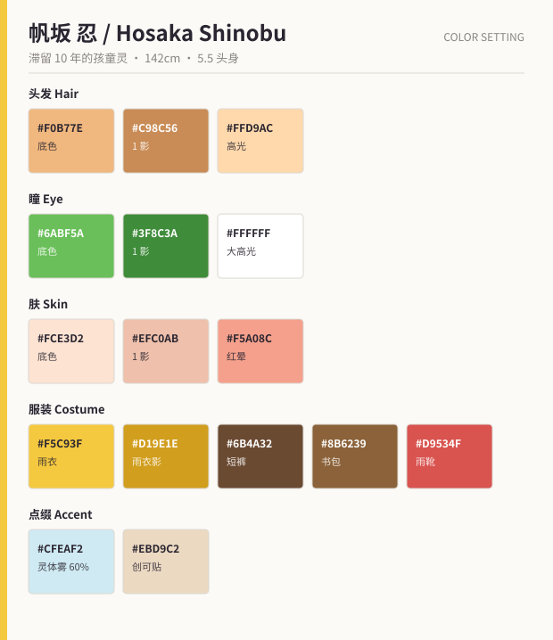

# 帆坂 忍（ほさか しのぶ / Hosaka Shinobu）

> 「我在等人哦。……等谁来着？」

---

## 1. 基础信息

| 项目 | 内容 |
| --- | --- |
| 定位 | 配角 · 元气担当 / 全剧最大的伏笔 |
| 外观年龄 | 12 岁（外观固定，实际已滞留 10 年） |
| 性别 | 中性设计（刻意不明示，官方标记为"不明"） |
| 身高 | 142 cm |
| 状态 | 游荡的孩童灵，招领所的常客 |
| CV 印象 | 中性的少年少女声，语速快、句尾常带笑音 |

---

## 2. 性格

- 元气、聒噪、好奇心过剩，把招领所当成游乐场。
- 记不住"自己在等谁"，但每天都会准时出现在雾见站旧月台。
- 是全剧的**情绪缓冲带**：每次沉重的送别之后，由忍把气氛拉回来。
- **口癖**：「なんで？なんで？」（为什么？为什么？）
- **规则**：只能在雨天或雾夜显形。晴天时招领所会突然安静下来——
  这个"缺席"本身就是演出手法。

## 3. 关于书包（核心伏笔）

背上那只旧皮革书包**永远打不开**。忍自己也不知道里面有什么，只知道"不能弄丢"。

- 书包＝忍的执念本体。打开它，忍就会消散。
- 里面装的是**十年前雾见站事故那天，要交给某人的东西**。
- 第 11 话揭示：忍是那场事故的遇难儿童之一，
  而当年被他/她推出月台因而幸存的孩子，就是**时雨冴**。
- 书包里是一张画：三个穿黄色雨衣的孩子。第三个是幼年的灯莉。

---

## 4. 外貌设计

### 4.1 头部

| 部位 | 设计 |
| --- | --- |
| 发型 | 杏色蓬松短发，发梢自然卷翘、方向随机（作画时每张都可微调，是全员中唯一允许"乱"的发型） |
| 瞳 | 明亮的草绿色圆瞳，**高光面积是全员最大**（占瞳孔 1/3），负责"生命力" |
| 眉 | 短而圆，眉毛动作幅度全员最大 |
| 特征 | 左脸颊贴一块米色创可贴（十年不变，从未换过——细思恐极的细节） |
| 肤 | 暖调，脸颊常驻红晕 |

### 4.2 服装

- **亮黄色连帽雨衣**：帽子基本常戴，帽檐画成略硬的尖角（剪影识别点）。
  雨衣下摆及大腿，袖口有两道白色反光条。
- 深棕短裤 + 红色雨靴（左右各贴一枚不同的贴纸）。
- **旧皮革书包**：鼓鼓囊囊，扣带上挂一枚小铃铛。
  铃铛只在忍情绪激动时响，**平时无声**——这是"他/她已经不是活人"的听觉暗示。

### 4.3 灵体表现

- 膝盖以下逐渐半透明，脚踝处化为淡雾（`#CFEAF2`，不透明度 60%）。
  **不画脚**，也不画影子。
- 在雨中，雨滴会**穿过身体**落地：作画时雨线不做遮挡处理，只在穿过瞬间做一格青碧色闪烁。
- 情绪高涨时轮廓会短暂实体化（雾散、露出脚），这是"接近消散"的危险信号——
  越有精神，就越接近告别。

### 4.4 配色

| 用途 | 底色 | 1 影 | 2 影 / 高光 |
| --- | --- | --- | --- |
| 头发 | `#F0B77E` | `#C98C56` | 高光 `#FFD9AC` |
| 瞳 | `#6ABF5A` | `#3F8C3A` | 高光 `#FFFFFF`（大面积） |
| 肤 | `#FCE3D2` | `#EFC0AB` | 红晕 `#F5A08C` |
| 雨衣 | `#F5C93F` | `#D19E1E` | 反光条 `#FFFFFF` |
| 短裤 / 书包 | `#6B4A32` / `#8B6239` | `#4A3222` / `#5F4126` | — |
| 点缀 | 雨靴 `#D9534F` ／ 灵体雾 `#CFEAF2` ／ 创可贴 `#EBD9C2` |

---

## 5. 差分

| 编号 | 名称 | 用途 |
| --- | --- | --- |
| A | 通常（雨衣 + 帽子戴上） | 主力 |
| B | 脱帽（露出全部乱发） | 室内、放松场景 |
| C | 生前（10 年前 · 同款雨衣但崭新，有影子、有脚） | 回忆篇。**"有影子"是与现在的唯一区别，不要漏画** |
| D | 消散过程（自下而上化为光粒） | 第 11 话 |

---

## 6. 表情差分

| # | 表情 | 要点 |
| --- | --- | --- |
| 1 | 元气笑 | 咧嘴露上齿、闭眼、眉高抬。**默认状态** |
| 2 | 好奇 | 头倾 20°、单眉上挑、嘴张成小圆 |
| 3 | 得意 | 双手叉腰、鼻孔微抬、眼半眯 |
| 4 | 闹别扭 | 鼓腮 + 撇嘴 + 视线上飘 |
| 5 | 发呆（想不起来时） | 瞳孔高光**全部消失**，面无表情。这张脸是全剧最恐怖的一格 |
| 6 | 快哭了 | 眉八字、下唇抖、眼里蓄泪但不落 |
| 7 | 安心的笑 | 眼睑半垂的柔和笑容，与灯莉的 8 号表情构图对称 |
| 8 | 消散（最后一张脸） | 正面、微笑、眼睛画满高光。这是全剧的作画顶点，指定原画 |

---

## 7. 作画注意事项

1. **绝对不画脚、不画影子**。晴天场景中忍不能登场，这是世界观硬性约束。
2. **铃铛不响**。音响与作画要对齐：铃铛在画面上摇动但无音效，只有第 11 话才响一次。
3. **创可贴永远在左脸同一位置**，不换、不掉、不脏。
4. **发型可乱**：忍是全员中唯一允许作画者自由发挥发梢方向的角色，
   用来在群像镜头里制造"活人感"的错觉——这个错觉正是本作要打破的东西。
5. 与灯莉、冴的**黄色雨衣三重奏**是本作的核心视觉母题。
   任何涉及雨衣的分镜，必须与总作画监督确认后再作画。
